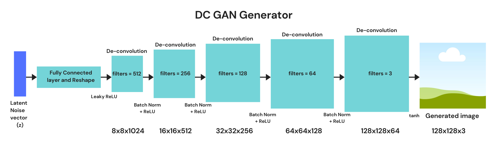

# merishnas-generate-art-gans

Generating unique architectures using **Generative Adversarial Networks.**

1. Start by creating a virtual environment for installing the libraries.

```python3 -m virtualenv venv```

**Note:** If you have not installed the virtualenv library, you can do so by running:

```python3 -m pip install --user virtualenv```

2. Activate the environment.

	For Windows:

	```
	cd venv/Scripts
	activate
	```

	For MacOS/Linux:

	```source env/bin/activate```

3. Go back to the root directory and install the requirements.txt.

```pip install -r requirements.txt```

**Note:** Here, we are using TensorFlow v1 for which Python 3.8 is not supported. Please install Python 3.6 or earlier.

4. We will be using Jupyter Notebook to run our code. You can install it using pip.

```pip install notebook```

5. The `GAN_generation.ipynb` file contains the code for Image generation.

To run the ipynb notebook, you can run the following command at the Terminal (Mac/Linux) or Command Prompt (Windows) which will open the notebook:

```jupyter notebook````

### Generative Adversarial Networks Architecture

For the purpose of this tutorial, we are using Deep Convolutional GANs (DC GANs). GANs consist of 2 types of networks, Generative and Adversarial.

1. Generative Network are a class of networks responsible for generation. This network is also known as generator.
2. Adversarial Network are networks opposite of the Generative Network, i.e., they are responsible for classifying if the generated image is real or fake. This network is also known as discriminator.

#### DC GAN Generator 

A generator takes in a random noise vector (z) as input and outputs a fake image. We are using a de-convolutional neural network, whose architecture is the opposite of a conventional convolutional neural network. The idea behind doing this is that, at every layer of the network, as we halve the filter size, the size of the image is doubled, which finally results in a generated images.



#### DC GAN Discriminator

A discriminator takes in the real or generated image as an input and outputs a score based on its predictions. The network uses a CNN whose task is to classify the images from the training data set (real) and which come from the generator (fake).


#### Results

Here is a sample of what the results look like.


Note: You can download the model checkpoints I've trained from [here](https://drive.google.com/drive/folders/1ApQPifX9OoIzjPjzuMjRZKRvs4WtU_pM?usp=sharing). Change "from_checkpoint=True" in the notebook.

### Citations

- The dataset for Architectural images was downloaded from [WikiArt Library](https://www.wikiart.org/en/paintings-by-genre) which contains a lot of artworks classified on the basis of genre.
- [References from PokeGAN](https://github.com/llSourcell/Pokemon_GAN)
